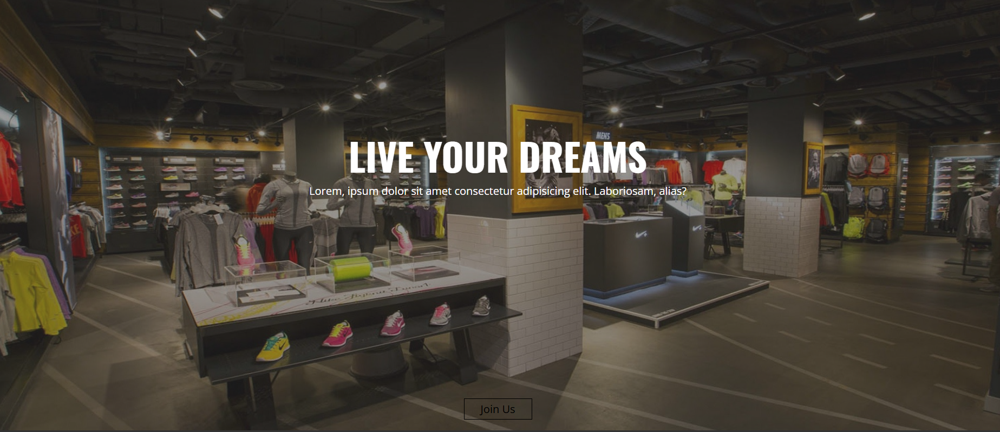
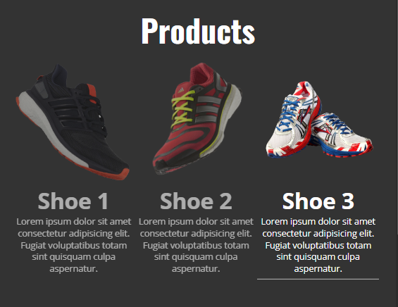
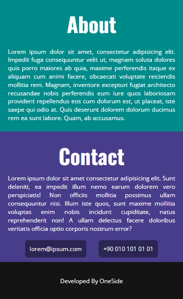

# Web Application Project Sports Store
<br>
<div align="center" justify="center">
    
    <br>
    
    
</div>  

This repository contains the frontend part of the Sports Store web application. The project is designed using HTML and CSS, with a focus on creating a responsive and interactive user interface. The frontend incorporates modern design principles and is optimized for various devices and screen sizes.
<br>
**Preview:** You can view the demo video [here](https://drive.google.com/file/d/1jdTXLcRLFDSqMFG54Dprxg795JP7yFHa/view?usp=sharing).


## Features

### Frontend

- **Responsive Design**: Ensures that the web application looks and functions well on desktops, tablets, and mobile devices.
- **Modern UI/UX**: Clean and intuitive design for an enhanced user experience.
- **Product Listings**: Display of sports products with images, descriptions, and prices.
- **User Registration and Login**: Forms for user account management and authentication.
- **Shopping Cart**: Ability to add products to a cart and proceed to checkout.
- **Search Functionality**: Allows users to search for products by name or category.
- **Form Validation**: Ensures that user input is valid before submission.


## Installation

### Clone the Repository

To get started with the project, clone the repository using the following command:

```bash
git clone https://github.com/OneSideMoon/real-estate
```

### Navigate to the Project Directory

Once you have cloned the repository, navigate to the project directory using the following command:

```bash
cd real-estate
```

### Open the Project

To view the application, open the `index.html` file in your web browser. You can do this by either double-clicking the file in your file explorer or using a local server setup.


## Technologies Used

- **HTML**: Provides the structure and content of the web application.
- **CSS**: Handles styling and layout, including responsive design.
- **JavaScript**: Adds interactive features and animations to enhance user experience.
- **Mapping Service**: Used for displaying property locations on maps (e.g., Google Maps, Leaflet).


## Contributing

I welcome feedback and contributions. If you have suggestions or fixes, please feel free to open a pull request or create an issue.


## Contact

If you have any questions or would like to get in touch with me, you can reach me through the following channels:
- [LinkedIn](https://www.linkedin.com/in/muhammet-batuhan-sahin-965b81216/)
- [Instagram](https://www.instagram.com/one.side.moon/)
- [Email](mailto:batuhansahin9040@gmail.com)


## License

This project is licensed under the [MIT License](https://github.com/OneSideMoon/frontend-mentor-challenge/blob/main/LICENSE).
